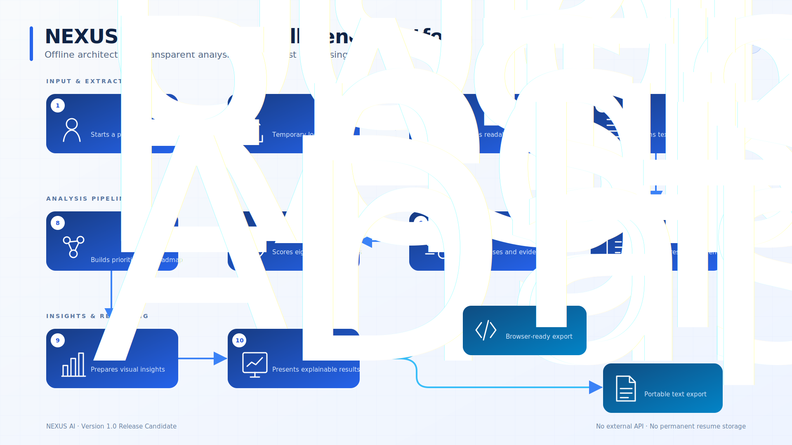

<div align="center">

# NEXUS AI Resume Intelligence Platform

### AI-Powered Resume Intelligence for Smarter Career Decisions

An open-source, offline-first platform for comparing a PDF resume with a job description and producing transparent skill, ATS-readiness, career-gap, and learning-roadmap guidance.

[](https://www.python.org/)
[](https://streamlit.io/)
[](LICENSE)


[Features](#key-features) · [Installation](#installation) · [Documentation](#documentation) · [Contributing](CONTRIBUTING.md)

</div>

---

## Project Overview

NEXUS AI Resume Intelligence Platform analyzes a text-based PDF resume against a target job description. Its deterministic offline engines identify required skills, detect resume evidence, estimate ATS readiness, surface career gaps, and organize practical next steps.

The current release candidate does not call OpenAI or any external AI API. “AI-powered” describes the platform’s resume-intelligence product direction; Version 1.0 results are generated by transparent, rule-based analysis that can be inspected and tested locally.

The platform includes:

- Resume analysis and PDF text extraction
- Rule-based ATS readiness assessment
- Resume intelligence and evidence-based summaries
- Skill-gap and priority analysis
- Career recommendations and immediate actions
- Personalized three-phase learning roadmap
- Downloadable HTML and text reports
- Local temporary-file processing with no permanent resume storage

## Key Features

| Capability | What it provides |
|---|---|
| Resume Analysis | Extracts readable text from PDF resumes and validates missing, malformed, encrypted, or image-only files. |
| Skill Matching | Maps job-description requirements to canonical skills using case-insensitive aliases and word boundaries. |
| ATS Readiness | Scores eight transparent categories, including contact completeness, sections, keyword coverage, achievements, and readability. |
| Resume Intelligence | Combines skill, ATS, and evidence signals into an executive summary and career-readiness guidance. |
| Priority Gaps | Classifies missing skills as High, Medium, or Low priority using explicit job-description cues. |
| Recommendations | Produces offline next steps based on detected gaps without claiming unverified experience. |
| Learning Roadmap | Organizes recommended topics, deliverables, duration, and success criteria into three phases. |
| Visual Analytics | Presents score comparisons, ATS categories, skill coverage, priority gaps, and roadmap scope. |
| Download Center | Generates escaped HTML and stable plain-text reports without retaining the uploaded resume. |
| Privacy First | Runs active analysis locally with no database, cloud upload, or required external AI service. |

## Screenshots

Release screenshots are intentionally not fabricated. The following portfolio images are planned and documented in the [screenshot guide](screenshots/README.md):

| View | Planned file | Status |
|---|---|---|
| Home / New Analysis | `screenshots/home-new-analysis.png` | Pending capture |
| Dashboard | `screenshots/dashboard-overview.png` | Pending capture |
| ATS Review | `screenshots/ats-review.png` | Pending capture |
| Resume Intelligence | `screenshots/resume-intelligence.png` | Pending capture |
| Learning Roadmap | `screenshots/learning-roadmap.png` | Pending capture |
| Download Center | `screenshots/download-center.png` | Pending capture |

## Architecture Overview

The application separates deterministic processing from presentation:

```text
PDF resume + job description
            │
            ▼
      PDF text extraction
            │
            ▼
       Skill matching
            │
       ┌────┴────┐
       ▼         ▼
 ATS readiness   Resume evidence
       └────┬────┘
            ▼
   Resume intelligence
            │
     ┌──────┼────────┐
     ▼      ▼        ▼
 Dashboard  Roadmap  HTML / text reports
```

- `core/` owns extraction, analysis, and report generation.
- `ui/` owns Streamlit components, charts, navigation, and styling.
- `streamlit_app.py` coordinates validation, temporary files, and session state.
- `config.py` centralizes product metadata, limits, and session keys.



The diagram is available as an editable [SVG](assets/architecture/architecture.svg) and a high-resolution [PNG](assets/architecture/architecture.png). The technical source of truth remains [docs/architecture.md](docs/architecture.md).

## Technology Stack

| Technology | Role |
|---|---|
| Python 3.12 | Application language and release-tested baseline |
| Streamlit | Interactive dashboard and local application runtime |
| pypdf | PDF validation and text extraction |
| Altair | Current chart rendering through Streamlit’s supported visualization stack |
| Python Standard Library | Unit tests, temporary files, validation scripts, regular expressions, paths, and logging |
| Matplotlib | Planned visualization option; not required or imported by the Version 1.0 runtime |

Direct runtime versions are pinned in [requirements.txt](requirements.txt).

## Installation

### 1. Clone the repository

```bash
git clone https://github.com/drrnhilario-lgtm/Project-NEXUS-AI.git
cd Project-NEXUS-AI
```

### 2. Create a virtual environment

```bash
python -m venv .venv
```

Activate it:

```powershell
# Windows PowerShell
.\.venv\Scripts\Activate.ps1
```

```bash
# macOS or Linux
source .venv/bin/activate
```

### 3. Install pinned dependencies

```bash
python -m pip install --upgrade pip
python -m pip install -r Projects/ai-resume-analyzer/requirements.txt
```

### 4. Launch Streamlit

```bash
python -m streamlit run Projects/ai-resume-analyzer/streamlit_app.py
```

## Quick Start

1. Open **New Analysis** from the sidebar.
2. Upload a text-based PDF resume.
3. Paste the complete job description; at least 50 characters are required.
4. Select **Analyze Resume**.
5. Review Dashboard, Results, ATS Review, Resume Intelligence, and Learning Roadmap.
6. Open Download Center to export the HTML or text report.

Encrypted and image-only PDFs are rejected with controlled guidance. The uploaded temporary PDF is deleted after processing.

## Project Structure

```text
ai-resume-analyzer/
├── core/               Offline analysis and report engines
├── ui/                 Streamlit presentation components
├── tests/              Unit, security, boundary, and workflow tests
├── tests/fixtures/     Synthetic, non-personal test data
├── scripts/            Read-only release validation
├── docs/               Architecture and release documentation
├── assets/             Architecture artwork and future brand assets
├── screenshots/        Future portfolio screenshots
├── demo/               Future GIF/video guidance
├── sample-data/        Demonstration inputs
├── outputs/            Locally generated example reports
├── config.py           Version, product, limits, and session keys
├── streamlit_app.py    Web entry point
└── app.py              Command-line report entry point
```

## Documentation

| Document | Purpose |
|---|---|
| [Documentation Index](docs/index.md) | Directory of technical and release documentation |
| [Architecture](docs/architecture.md) | Modules, data flow, scoring boundaries, tests, and validation |
| [Code Quality Audit](docs/code-quality-audit.md) | RC engineering assessment and remaining risks |
| [Release Checklist](docs/release-checklist.md) | Automated and manual Version 1.0 gates |
| [Roadmap](ROADMAP.md) | Completed work and realistic Version 1.1/2.0 direction |
| [Roadmap Compatibility Link](docs/roadmap.md) | Pointer retained for existing documentation references |
| [Changelog](CHANGELOG.md) | Keep a Changelog release-candidate record |
| [Contributing Guide](CONTRIBUTING.md) | Branches, style, testing, issues, and documentation |
| [Code of Conduct](CODE_OF_CONDUCT.md) | Contributor Covenant 2.1 community standards |
| [Security Policy](SECURITY.md) | Supported versions, reporting, privacy, and security scope |
| [Screenshot Guide](screenshots/README.md) | Safe screenshot requirements and planned views |
| [Demo Guide](demo/README.md) | Planned 30–60 second demo sequence |
| [Asset Guide](assets/README.md) | Architecture artwork plus future logo, banner, and icon guidance |

## Testing

The release candidate uses the Python standard-library `unittest` framework and currently includes 59 tests covering analysis engines, PDF extraction, alias boundaries, HTML safety, reporting, chart preparation, edge cases, and the complete offline workflow.

From the repository root:

```bash
python -m compileall Projects/ai-resume-analyzer
python -m unittest discover -s Projects/ai-resume-analyzer/tests -v
python Projects/ai-resume-analyzer/scripts/validate_release.py
```

The release validator checks required files, compilation, tests, pinned dependencies, tracked secret filenames, documentation, and startup independence from generated outputs.

## Privacy

- Active analysis runs offline and requires no OpenAI or external AI API.
- Uploaded resumes use a server-created temporary file that is deleted in a `finally` block.
- Resume contents and full contact values are not permanently stored by the application.
- No database, authentication provider, telemetry service, or automatic cloud upload is used.
- Dynamic report content is HTML-escaped and covered by security regression tests.

Read [SECURITY.md](SECURITY.md) for vulnerability reporting and the complete privacy summary.

## Roadmap

### Completed

- Offline extraction and transparent analysis engines
- Modular Streamlit dashboard and visual insights
- HTML/text Download Center
- 59-test hardening suite and release validator
- Open-source governance and release documentation

### Version 1.1

- Expanded role-specific skill taxonomy
- Configurable local skill dictionaries
- Accessibility and integration-test improvements
- Report-generation and packaging refinements

### Version 2.0

- Additional local input formats
- Configurable offline analysis profiles
- Richer explainability and comparison workflows
- Optional local history only with explicit consent and deletion controls

See the canonical [ROADMAP.md](ROADMAP.md) for details and project ideas.

## Contributing

Contributions are welcome when they preserve transparent scoring, offline-first operation, user privacy, and testability. Read [CONTRIBUTING.md](CONTRIBUTING.md) before opening an issue or pull request, and follow the [Code of Conduct](CODE_OF_CONDUCT.md).

## License

Copyright © 2026 Darren Hilario.

This project is distributed under the [MIT License](LICENSE).

## Author

**Darren Hilario**  
Creator and maintainer of NEXUS AI Resume Intelligence Platform  
[GitHub profile](https://github.com/drrnhilario-lgtm)

## Acknowledgements

- [Python](https://www.python.org/) for the language and standard library
- [Streamlit](https://streamlit.io/) for the application framework
- The open-source community for the libraries, standards, and engineering practices that support this project

---

<div align="center">
  <strong>NEXUS AI Resume Intelligence Platform</strong><br>
  Privacy First · Offline First · Open Source · Data Driven · Career Focused
</div>
